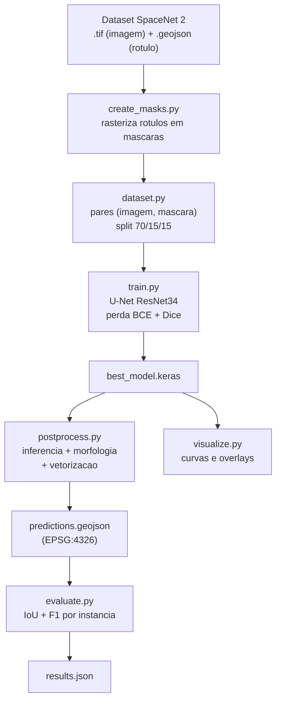

# Segmentação de Edificações em Imagens de Satélite - SpaceNet 2 (AOI 3, Paris)

## 1. Disciplina

Este é um projeto desenvolvido para a disciplina EEL7815 - Processamento Digital
de Imagens, ministrada pelo Prof. Joceli Mayer no curso de Engenharia Elétrica
da Universidade Federal de Santa Catarina (UFSC), no semestre 2026.1. O trabalho
foi realizado individualmente pelo aluno José Eduardo Pereira.

## 2. Objetivo Geral e Ideia do Projeto

O projeto implementa uma pipeline completa de segmentação semântica de
edificações em imagens de satélite de alta resolução. Dada uma imagem aérea de
um recorte urbano (tile), o sistema identifica automaticamente as edificações
presentes e produz, como saída, polígonos vetoriais georreferenciados (em
latitude e longitude) delimitando cada construção detectada.

A ideia central é tratar o problema como uma tarefa de segmentação binária
pixel-a-pixel, em que cada pixel é classificado como edificação ou fundo. Em
seguida, uma etapa de pós-processamento converte a máscara de probabilidade
produzida pela rede em geometrias vetoriais, que podem ser abertas diretamente
em ferramentas de Sistema de Informação Geográfica (SIG), como o QGIS. O produto
final é conceitualmente análogo ao Microsoft Global ML Building Footprints, que
mapeia edificações em escala global a partir de imagens de satélite.

## 3. Objetivos Específicos

3.1. Construir um carregador de dados capaz de parear imagens GeoTIFF de 16 bits
com suas anotações vetoriais (GeoJSON), tratando a normalização de intensidade e
a rasterização dos rótulos.

3.2. Implementar e treinar uma rede U-Net com backbone ResNet34 pré-treinado no
ImageNet, utilizando uma função de perda combinada (BCE + Dice).

3.3. Aplicar técnicas clássicas de Processamento Digital de Imagens no
pós-processamento: limiarização, morfologia matemática, extração e simplificação
de contornos.

3.4. Avaliar o modelo quantitativamente, por métricas no nível de instância (IoU
e F1-score), e qualitativamente, por sobreposição visual das predições sobre as
imagens.

3.5. Comparar duas estratégias de tratamento da resolução de entrada (recorte
por janelas, "tiling", versus redimensionamento do tile inteiro, "resize") sob o
mesmo conjunto de dados e a mesma semente aleatória.

## 4. Requisitos e Dependências

### 4.1. Requisitos Funcionais

- Validação de integridade e rasterização das anotações do dataset
- Divisão reprodutível dos dados em treino, validação e teste (70/15/15)
- Treinamento com early stopping e seleção do melhor modelo pela métrica de IoU
- Inferência georreferenciada com exportação para GeoJSON (EPSG:4326)
- Avaliação por instância, contabilizando acerto quando o IoU é maior que 0,5

### 4.2. Requisitos Técnicos (requirements.txt)

- Python 3.10 ou superior, com TensorFlow 2.16+ e tf-keras
- segmentation-models (arquitetura U-Net com backbone pré-treinado)
- rasterio, geopandas e shapely (leitura e manipulação de dados geoespaciais)
- opencv-python-headless (morfologia e extração de contornos)
- albumentations (data augmentation)
- matplotlib, numpy e Pillow

### 4.3. Ambiente de Execução

O treinamento exige uma GPU NVIDIA com CUDA. No Windows, o uso de GPU exige o
WSL2 (Ubuntu), pois o TensorFlow 2.16+ não oferece suporte a GPU nativamente no
Windows. O treinamento deste projeto foi realizado em uma RTX 3060 Ti (8 GB),
executada por meio do WSL2.

## 5. Organização do Repositório

```
p2/
├── scripts/          núcleo da pipeline
│   ├── dataset.py        carregamento de dados, splits, augmentation
│   ├── train.py          treinamento da U-Net
│   ├── postprocess.py    inferência e geração de polígonos
│   ├── evaluate.py       métricas IoU e F1 por instância
│   └── validate_dataset.py  validação e rasterização de debug
├── util/             utilitários
│   ├── create_masks.py     cache de máscaras rasterizadas
│   ├── create_previews.py  conversão de GeoTIFF 16-bit em PNG visível
│   └── visualize.py        geração de figuras
├── notebooks/        análise e demonstração
│   ├── dataset_check.ipynb  exploração do dataset
│   └── demo.ipynb           inferência interativa
├── artefatos/        modelos treinados, métricas e splits
├── figures/          figuras geradas
├── requirements.txt
└── README.md
```

## 6. Pipeline e Fluxo de Execução

A pipeline é linear: cada etapa é um script independente, acionável por linha de
comando (argparse), sem caminhos fixos no código. A ordem de execução é
`create_masks.py` -> `train.py` -> `postprocess.py` -> `evaluate.py` ->
`visualize.py`. O módulo `dataset.py` é importado pelo treinamento, e não
executado isoladamente.



### 6.1. Arquitetura do Modelo

- Codificador: ResNet34 pré-treinado no ImageNet (transfer learning)
- Decodificador: U-Net com conexões de salto (skip connections)
- Entrada: 256x256x3; saída: 256x256x1 (ativação sigmoide)
- Perda: BCE + Dice (pesos 0,5 / 0,5); otimizador: Adam (lr = 1e-4)
- Normalização: percentil 2-98 por tile (16 bits para o intervalo [0, 1])

## 7. Arquivos Lidos e Gerados

Cada etapa consome entradas e produz saídas bem definidas. A tabela abaixo
resume o que cada script lê e gera.

| Script | Lê | Gera |
|--------|-----|------|
| `validate_dataset.py` | tiles `.tif` e rótulos `.geojson` | overlays de debug e relatório de integridade |
| `create_masks.py` | tiles `.tif` e rótulos `.geojson` | máscaras `.png` (cache em `train/masks/`) |
| `dataset.py` | tiles, máscaras e `splits.json` | `splits.json` e os lotes (imagem, máscara) em memória |
| `train.py` | tiles, máscaras e `splits.json` | `best_model.keras`, `training_history.json`, `splits.json` |
| `postprocess.py` | `best_model.keras`, tiles e `splits.json` | `predictions.geojson` (EPSG:4326) |
| `evaluate.py` | `predictions.geojson`, rótulos `.geojson` e `splits.json` | `results.json` |
| `visualize.py` | `training_history.json`, `predictions.geojson`, tiles e rótulos | figuras `.png` em `figures/` |
| `create_previews.py` | tiles `.tif` de 16 bits | previews `.png` de 8 bits visíveis |

## 8. Resultados e Testes

O conjunto rotulado é composto por 1148 tiles (650x650, 16 bits), divididos em
803 para treino, 172 para validação e 173 para teste. A avaliação quantitativa
foi feita sobre o conjunto de teste interno, que possui rótulos.

Foram treinadas duas configurações, sob o mesmo split e a mesma semente
aleatória, para comparar as estratégias de tratamento da resolução:

| Métrica | Tiling | Resize |
|---------|--------|--------|
| IoU de validação | **0,7251** | 0,6327 |
| Precisão | **0,70** | 0,68 |
| Revocação | **0,55** | 0,47 |
| F1-score | **0,62** | 0,56 |
| IoU médio | **0,72** | 0,70 |
| Épocas | 37 | 40 |

A configuração tiling (recorte em resolução nativa) superou a resize
(redimensionamento do tile inteiro) em todas as métricas, com diferença mais
expressiva na revocação. Isso ocorre porque o redimensionamento comprime os
tiles e suprime as edificações menores, reduzindo o número de detecções
corretas. O tiling, por preservar a resolução original, detecta mais
edificações. Ambos os treinamentos ocorreram em GPU, com duração aproximada de
30 minutos cada.

Como validação qualitativa adicional, o modelo treinado foi aplicado a imagens
completamente fora do domínio do dataset (capturas de tela do Google Maps de
regiões de Florianópolis). O modelo detectou edificações de forma consistente,
desde que a escala aparente das construções fosse compatível com a escala vista
durante o treinamento, evidenciando capacidade de generalização e, ao mesmo
tempo, sua sensibilidade à escala.

## 9. Próximos Passos

O treinamento da pipeline está validado e produz resultados consistentes. A
partir desta base, os próximos passos visam melhorar o desempenho e a robustez
do modelo:

- Reaproveitar os conjuntos de validação e teste no treino: como a comparação
  entre tiling e resize já foi concluída, é possível treinar com mais dados, sem
  reservar o split de teste interno, aumentando a quantidade de exemplos
  rotulados disponíveis.
- Aplicar fine-tuning sobre o modelo atual e experimentar outras estratégias de
  transfer learning, com diferentes backbones ou pesos pré-treinados.
- Implementar uma etapa de realce de nitidez e contraste para imagens fora do
  domínio do dataset (por exemplo, capturas do Google Maps), tornando o modelo
  mais robusto a fontes de imagem diferentes da do treinamento.
- Substituir o limiar fixo de binarização (0,5) por uma limiarização adaptativa
  (Otsu) e ajustar os parâmetros morfológicos ao domínio.
